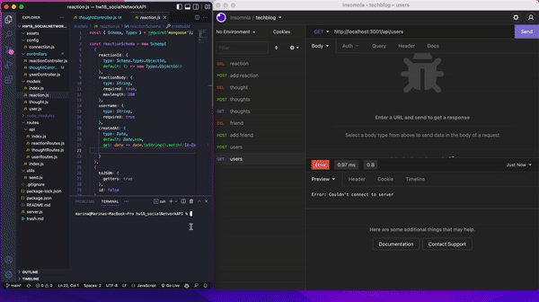

# hw18_socialNetworkAPI

## Table of Contents 📚

- [Description](#description)
- [Preview](#preview)
- [Installation](#installation)
- [Usage](#usage)
- [Links](#links)

## Description 📋

Building an API for a social network web application where users can share their thoughts, react to friends’ thoughts, and create a friend list. Uses Express.js for routing, a MongoDB database, and the Mongoose ODM.

## Preview 📸

## Installation 🔐

- Clone the repository into your device
- npm i
- npm run seed
- node server

## Usage 🖥

Created for a social media startup that wants an API that uses a NoSQL database to handle large amounts of unstructured data. 

## Links 💾

**[GitHub Link ✨](https://github.com/mxhuisken/hw18_socialNetworkAPI)**

**[Demo ✨](https://youtu.be/ioZCK1yxcVM)**